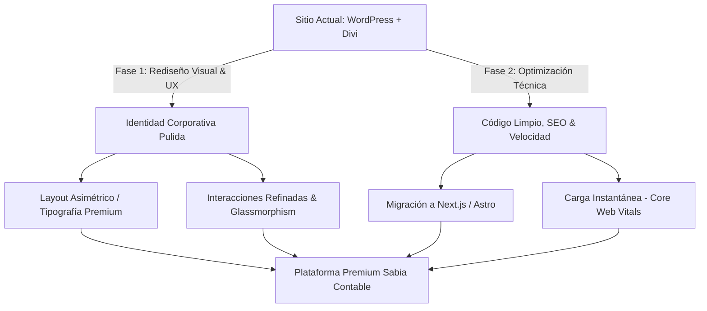

# Informe Técnico Ejecutivo: Auditoría y Propuesta de Modernización
## Sitio Web: [www.sabiacontable.cl](https://www.sabiacontable.cl)

**Preparado para:** Gerencia y Equipo de Desarrollo de Sabia Contable  
**Creado por:** HackTeck  
**Fecha:** 28 de mayo de 2026  
**Estado:** Finalizado

---

## 1. Introducción y Objetivos
Este informe técnico y ejecutivo presenta una auditoría exhaustiva del estado actual del sitio web de **Sabia Contable** y una propuesta detallada para su modernización estética y funcional.

El objetivo principal es transformar el sitio actual en una plataforma digital premium que transmita confianza, profesionalismo y modernidad tecnológica. Todo esto **manteniendo rigurosamente la identidad de marca**, que incluye:
* El logotipo oficial de Sabia Contable.
* Los colores institucionales: Azul Marino Oscuro (base) y Magenta (acento).

---

## 2. Auditoría Técnica y de Diseño del Sitio Actual

### 2.1 Stack Tecnológico y Desarrollo
*   **Plataforma Base:** WordPress.
*   **Constructor Visual:** Divi Builder (v.4.27.4).
*   **Análisis del Stack:**
    *   **Impacto de Divi:** Divi es un maquetador pesado que genera lo que en desarrollo se denomina *"div soup"* (anidamiento excesivo de contenedores `
` sin valor semántico).
    *   **Recursos Bloqueantes:** El sitio carga múltiples hojas de estilo dinámicas (`et-divi-dynamic-css`, `et-core-unified`) y archivos JS pesados de jQuery que retrasan la interactividad del usuario.
    *   **Plugins Instalados:** Contact Form 7 (formularios), Click to Chat (WhatsApp), Google Site Kit y reCAPTCHA de Google.

### 2.2 Diseño, Estética y Dirección de Arte
*   **Paleta de Colores:** 
    *   *Fondo:* Azul marino plano (`#0a2f4d`).
    *   *Acento:* Magenta institucional (`#d80073`).
    *   *Incoherencias Visuales:* Se detecta el uso de violeta brillante (`#9b00e8`) en botones y un fondo grisáceo apagado en una de las tarjetas estadísticas. Esto rompe la armonía y reduce el contraste visual.
*   **Tipografía:** 
    *   Uso de *Open Sans* y *Montserrat*. Son tipografías correctas pero sobreutilizadas y genéricas, lo que le resta personalidad y carácter al sitio web.
*   **Iconografía e Imágenes:**
    *   Los iconos de las tarjetas de servicios son glifos planos sencillos en color magenta.
    *   La sección *¿Por qué elegirnos?* utiliza fotografías de stock muy genéricas (apretón de manos sobre laptop, equipo uniendo manos, gráficos de negocios). Este recurso se percibe anticuado y de bajo costo.
*   **Profundidad Visual:** El diseño es completamente plano y carece de texturas, micro-interacciones o sombras con volumen (las sombras son negras y planas con baja opacidad).

### 2.3 Experiencia de Usuario (UX) y Usabilidad
*   **Heurística de Consistencia y Estándares:** Los botones principales de llamadas a la acción (CTA) cambian arbitrariamente entre magenta y violeta.
*   **Interactividad Básica (Hover/Active):** La respuesta táctil o de cursor al interactuar con botones y enlaces es inmediata y brusca, sin transiciones suavizadas por CSS. No hay simulación de presión física (`scale` o `translate`) al hacer clic.
*   **Reachability (Ergonomía Móvil):** En dispositivos móviles, el menú de hamburguesa se ubica en la esquina superior derecha, una zona de difícil acceso con el pulgar en pantallas de gran tamaño.

### 2.4 SEO, Accesibilidad y Rendimiento (Métricas Lighthouse)
Una auditoría automatizada preliminar arroja los siguientes resultados en entorno de escritorio:

| Métrica | Puntuación | Estado | Observación |
| :--- | :---: | :---: | :--- |
| **SEO** | **92 / 100** | Bueno | Falta optimizar metadatos y jerarquía. |
| **Accesibilidad** | **79 / 100** | Regular | Problemas de contraste texto-fondo y falta de textos alternativos (`alt`). |
| **Best Practices** | **73 / 100** | Regular | Advertencias por librerías jquery desactualizadas y consola. |

*   **Problemas Críticos de SEO:**
    *   **Ausencia de Meta Descripción:** La etiqueta `<meta name="description">` no está definida, lo que reduce la tasa de clics (CTR) en las búsquedas de Google.
    *   **Jerarquía de Encabezados Incorrecta:** El sitio web posee múltiples etiquetas `<h1>` (ej. "¡Lleva tu contabilidad al siguiente nivel!" y "¿Por qué elegirnos?"). Google penaliza esto; debe existir un único `<h1>` por página.
    *   **Encabezados Basura:** La estructura DOM revela encabezados ocultos de WordPress como "Archives" y "Categories" (`<h2>`), lo que confunde a los rastreadores de motores de búsqueda.

---

## 3. Propuesta de Modernización Premium
*Aplicación de las habilidades `redesign-existing-projects` y `ux-audit` del flujo de trabajo.*

### 3.1 Transición del Stack Tecnológico (Recomendado)
Para eliminar el peso excesivo de WordPress y Divi, se propone migrar la web hacia un stack moderno:
1.  **Framework:** **Astro** o **Next.js** en su versión estática.
2.  **Estilos:** **Tailwind CSS v4** o **CSS Vanilla** modular.
3.  **Resultado:** Reducción del peso de la página en un **90%**, logrando una velocidad de carga instantánea (Score Lighthouse de **100/100** en rendimiento).

---

### 3.2 Dirección de Arte y Estética Premium
Mantendremos el logo y los colores corporativos, pero redefiniremos su uso estratégico para lograr un aspecto de alta gama:

*   **Tipografía de Carácter:**
    *   *Títulos principales:* **Outfit** o **Cabinet Grotesk**. Son fuentes modernas y pesadas que, combinadas con un espaciado de letras ajustado (`letter-spacing: -0.02em`), dan presencia y sofisticación.
    *   *Cuerpo de texto:* **Geist Sans** o **Satoshi**. Diseñadas específicamente para pantallas de alta resolución, garantizando una excelente legibilidad con un alto de línea amplio (`line-height: 1.6`).
*   **Paleta de Colores Refinada:**
    *   *Fondo base:* Azul marino profundo (`#02121d` o `#031726`) en lugar del azul marino actual. Esto le da un tono oscuro muy elegante y mitiga el contraste molesto a los ojos.
    *   *Color de realce (Brand Accent):* Magenta brillante (`#e0007a`), aplicado en botones principales, estados activos y bordes sutiles.
    *   *Eliminación de Violeta:* Todos los botones violetas pasarán a ser magentas o usarán un estilo *ghost* semitransparente.
*   **Tratamiento de Superficies (Glassmorphism & Depth):**
    *   *Navegación Superior:* Barra de navegación flotante con efecto cristal (**glassmorphism** real: `backdrop-filter: blur(12px)` combinado con un borde interior de `1px` en color blanco con `0.05` de opacidad y sombra difuminada).
    *   *Sombras Tintadas:* En lugar de usar sombras negras genéricas (`rgba(0,0,0,0.1)`), utilizaremos sombras tintadas con el color del fondo (`rgba(2, 18, 29, 0.6)`) con mayor radio de difusión. Esto crea una ilusión óptica natural de profundidad 3D.
    *   *Textura y Ruido sutil:* Se añadirá un sutil patrón de grano (ruido digital) al fondo del sitio para romper la frialdad de los colores planos y otorgar textura táctil.

---

### 3.3 Rediseño de Secciones Clave

#### A. Hero Section (Inicio de Página)
*   **Actual:** Texto plano sobre fondo azul oscuro.
*   **Propuesta Premium:** Creación de un fondo dinámico con un gradiente radial difuso en tonos magenta en la parte superior derecha de baja opacidad. A la derecha, en lugar de una foto de stock, incorporaremos una ilustración abstracta en 3D creada a medida que represente el crecimiento financiero de forma conceptual, o bien una rejilla de datos financieros con bordes que se iluminan al pasar el cursor (**spotlight borders**).

#### B. Sección de Servicios
*   **Actual:** 5 tarjetas alineadas simétricamente en 2 filas con iconos magenta planos.
*   **Propuesta Premium:**
    *   **Diseño Asimétrico:** Distribución tipo rejilla con tamaños ligeramente variables para destacar los servicios estrella (Contabilidad Integral y Gestión Tributaria).
    *   **Bordes Dinámicos:** Tarjetas con bordes interactivos que siguen la posición del puntero del ratón (Spotlight Borders) mediante CSS y JS nativo.
    *   **Iconografía Personalizada:** Iconos lineales estilizados con un degradado de magenta a blanco, en lugar de iconos sólidos planos.

#### C. Sección "¿Por qué elegirnos?"
*   **Actual:** Fotos de stock genéricas en 2 columnas.
*   **Propuesta Premium:** Reemplazar las fotos por tarjetas interactivas de información interactiva. Cada una con un indicador numérico sutil y una transición de escala al pasar el ratón. Incorporación de micro-copys directos en voz activa (evitando textos clonados).

#### D. Widget de Indicadores Económicos (Utilitarios)
*   **Actual:** Tres cajas oscuras planas que muestran UF, UTM y Dólar con valores estáticos.
*   **Propuesta Premium:**
    *   **Integración Dinámica:** Conexión del widget con una API pública de indicadores financieros de Chile (ej. `mindicador.cl`), actualizando los valores automáticamente al cargar la página sin intervención manual.
    *   **Diseño Glassmorphic:** Tarjetas transparentes con tipografía monospace fluida (`font-variant-numeric: tabular-nums`) para los valores numéricos, permitiendo que la información se lea de forma limpia y alineada.

---

### 3.4 Mejoras en Experiencia de Usuario (UX) e Interacciones

*   **Micro-animaciones Naturales:**
    *   *Transiciones suaves:* Todos los botones, tarjetas y enlaces tendrán una transición CSS parametrizada en `300ms cubic-bezier(0.16, 1, 0.3, 1)` (efecto *ease-out-quint*).
    *   *Feedback de Clic Físico:* Al presionar cualquier botón de llamada a la acción (CTA) se aplicará un ligero escalado `transform: scale(0.97)` para simular una pulsación física.
*   **Navegación Móvil Ergonómica:**
    *   Implementación de una barra de navegación inferior flotante al estilo aplicación móvil (*Bottom Bar Navigation*) en pantallas pequeñas, facilitando el acceso a las secciones de "Contacto" y "Servicios" directamente con el pulgar.

---

### 3.5 Optimización de SEO, Accesibilidad y Rendimiento

1.  **SEO On-Page:**
    *   *Unificación H1:* El sitio contará únicamente con un título `<h1>` principal en el Hero. La sección "¿Por qué elegirnos?" pasará a ser un `<h2>`.
    *   *Eliminación de Basura de Plantilla:* Remoción completa de los selectores de "Archives" y "Categories" del DOM.
    *   *Metadatos:* Implementación de metaetiquetas descriptivas optimizadas para cada página y soporte Open Graph para redes sociales.
2.  **Accesibilidad (WCAG 2.1 AA):**
    *   *Contraste de Color:* El color del texto sobre los fondos oscuros se establecerá en un blanco roto de alta luminancia (`#f8fafc`).
    *   *Textos Alt:* Todas las imágenes decorativas y descriptivas contarán con atributos `alt` detallados para lectores de pantalla.

---

## 4. Conclusión e Impacto Estimado

Al implementar las mejoras de usabilidad y rendimiento recomendadas en este informe:

1.  **Confianza y Conversión:** El rediseño estético premium y la eliminación de fotos de stock genéricas aumentará la percepción de seriedad y profesionalismo, lo cual se traduce en un incremento en los leads del formulario de contacto y clics de WhatsApp.
2.  **SEO Orgánico:** La corrección en las etiquetas de encabezado y la adición de metadatos correctos impulsarán a Sabia Contable en los rankings locales de Google para búsquedas de asesorías contables.
3.  **Velocidad de Carga:** El usuario percibirá una carga de página instantánea en móviles y ordenadores de escritorio, evitando el rebote de potenciales clientes por lentitud.
